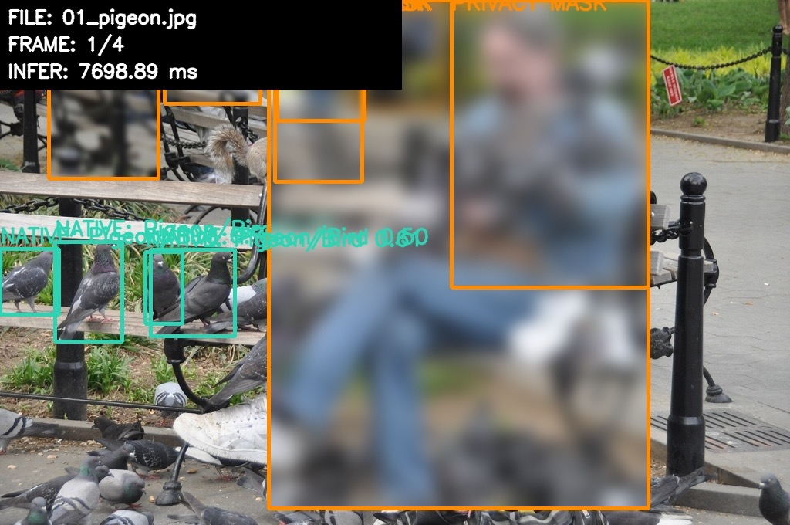

# NYC Wildlife CV Demo

An open-access blueprint for urban ecological monitoring built with a general-purpose object detector (YOLOv8n) and an AI coding agent in an afternoon—no custom model training or research grant required. It is a learning resource from the WTX × NYPL “Vibe Coding” panel: a small, inspectable prototype for testing an environmental-observation experience before committing to a custom model.

[3percentclub.org](https://3percentclub.org)<br>
*Video coming soon.*



## How it works (honestly)

YOLOv8n is trained on the general-purpose COCO dataset, not on a bespoke dataset of NYC wildlife. The application keeps inference separate from presentation and translates a few COCO labels into the vocabulary a rapid prototype needs:

| Original COCO class | Display label | Why it is here |
| --- | --- | --- |
| `bird` | `NATIVE: Pigeon/Bird` | A useful fit for common urban birds. |
| `cat` / `dog` | `NATIVE: Squirrel (Proxy)` | A deliberately provisional proxy for testing the squirrel-monitoring experience. |
| `mouse` | `ALERT: Rat/Mouse` | A label for the alert experience; COCO uses `mouse` for a computer-mouse peripheral, not a live rodent. |

This kind of semantic mapping is a legitimate rapid-prototyping technique: it lets a team validate the user journey, privacy treatment, and telemetry design before investing in a custom wildlife dataset and training cycle. It is not a species-identification claim.

The included subway-rat image is intentionally useful evidence of that boundary. When you run the base command-line pipeline, expect it to produce **zero `mouse` detections**: the unmodified COCO model does not treat a real rodent as its `mouse` class. The browser dashboard includes an optional manual alert override for demonstration; `app.py` does not.

## Run it yourself

You need Python 3.10, 3.11, or 3.12. A GPU is not required. On the first run, Ultralytics automatically downloads the approximately 6 MB YOLOv8n model weights. (The pinned Torch release does not support Python 3.13.)

### macOS

```bash
git clone https://github.com/mashby2022/nypl-demo.git
cd nypl-demo
python3 -m venv .venv
source .venv/bin/activate
python -m pip install --upgrade pip
pip install -r requirements.txt
python app.py
```

### Windows (PowerShell)

```powershell
git clone https://github.com/mashby2022/nypl-demo.git
cd nypl-demo
py -m venv .venv
.\.venv\Scripts\Activate.ps1
python -m pip install --upgrade pip
pip install -r requirements.txt
python app.py
```

An OpenCV window shows one image at a time. Press any key in that window to advance; the annotated images are also saved to `assets/outputs/`.

### Optional: API and Kaggle dataset search

The FastAPI service has image analysis plus Kaggle dataset-search endpoints. Its `/datasets/ingest` endpoint is a demo round-trip: it selects a local sample asset after a request rather than downloading a selected Kaggle dataset. The standalone `data_agent.py` contains the actual Kaggle download/extract utility.

```bash
pip install -r requirements-api.txt
cp .env.example .env
# Edit .env with credentials created at https://www.kaggle.com/settings/account
python api.py
```

On Windows, copy `.env.example` to `.env` in File Explorer or run `Copy-Item .env.example .env`. Never commit `.env` or `kaggle.json`.

To create a presentation-friendly synthetic CSV, run:

```bash
python mock_telemetry.py
```

It writes 2,000 simulated detections to `telemetry_history.csv` in the project root.

## What's in this repo

- `app.py` — the command-line pipeline: YOLO inference, label mapping, privacy masking, rendering, and image-by-image OpenCV display.
- `api.py` — FastAPI backend for uploaded-image analysis, Kaggle search, and a local-sample ingest demo response.
- `web_ui.py` — a separate Gradio upload interface that uses the same `VisionEngine` and `FrameRenderer` classes.
- `index.html` — a standalone browser dashboard that calls the FastAPI service and includes a manual rodent-alert override.
- `data_agent.py` — `KaggleSourcingAgent`, which authenticates, searches, downloads, extracts, and filters Kaggle image datasets.
- `run_pipeline.py` — an orchestration script that asks the Kaggle agent for urban-wildlife imagery, then starts the command-line pipeline.
- `mock_telemetry.py` — generator for a simulated, borough-and-ZIP-level telemetry CSV with seasonal class weighting.
- `CLAUDE.md` — the plain-language instruction file used to steer the AI coding agent while building this demo.
- `CREDITS.md` — source, author, and license information for all included sample images.

## Privacy by design

When YOLO detects a `person`, the renderer applies a Gaussian blur and an orange `PRIVACY MASK` label at the ingestion boundary—before the annotated frame is stored or displayed. The privacy safeguard is structurally inseparable from the observation: the same render step that makes a detection visible also removes identifying detail.

## Architecture and where this could go

The model layer and presentation layer are deliberately decoupled. A future, fine-tuned biological classifier can replace the base model without requiring a redesign of the display or API contract.

```text
input frame
    |
    v
VisionEngine (model inference)
    |
    v
detections + latency  --->  FrameRenderer (privacy mask + labels + HUD)
                                      |
                                      v
                           OpenCV output / API / web UI
```

The scaling path is practical: start with this laptop demo; move the same interface to low-cost edge devices; then connect community-owned sensor nodes that run privacy masking on-device and send only structured telemetry upstream. That keeps both cost and governance close to the people collecting the observations.

## Troubleshooting

- **No OpenCV window on macOS:** run `python app.py` from Terminal (not an environment without GUI access), click the OpenCV window to focus it, then press a key. If you are connected over SSH or using a headless environment, use the saved files in `assets/outputs/` instead.
- **Model download fails:** confirm you are online, then run `python app.py` again. Ultralytics caches the downloaded weights as `yolov8n.pt`.
- **Install errors or unsupported Python:** recreate the virtual environment with Python 3.10+ and use `python -m pip` so pip targets the active environment.

---

3percentclub builds practical access to tools that help communities understand and act on their own data. [Book a 30-minute consultation or audit](https://calendly.com/3percentclub/30-min-consulation-audit) · [AI Impact Calculator](https://aiimpactcalculator.com)
